

  <h1>Ocean View Resort Management System</h1>
  
<strong>Advanced Programming Assignment Repository</strong>

  

    A Java EE web application developed to digitize room management, reservation handling,
    and invoice generation for <strong>Ocean View Resort</strong>.
  

<h2>Module Information</h2>

<ul>
  <li><strong>Module:</strong> Advanced Programming</li>
  <li><strong>Unit Code:</strong> CIS6003</li>
  <li><strong>Institution:</strong> Cardiff Metropolitan University</li>
  <li><strong>Student Name:</strong> Anugi Dilanya Fernando</li>
  <li><strong>Student ID:</strong> CL/BSCSD/33/37</li>
  <li><strong>Registration No:</strong> st20306084</li>
  <li><strong>Case Study:</strong> Develop an interactive system with a set of interfaces to get the necessary user inputs for Ocean View Resort</li>
</ul>

<h2>Project Overview</h2>

  The <strong>Ocean View Resort Management System</strong> is a web-based resort management application built using
  <strong>Java Servlets, JSP, JDBC, MySQL, and Apache Maven</strong>. The system was designed to replace manual
  paper-based resort operations with a centralized digital solution.

  It allows staff members to securely log in, manage room records, create and track reservations,
  complete bookings, and generate invoices with automatic billing calculations including
  <strong>10% service charge</strong> and <strong>18% VAT</strong>.

<h2>Main Objectives</h2>

<ul>
  <li>Provide a secure login interface for staff authentication</li>
  <li>Manage room details using full CRUD functionality</li>
  <li>Create and monitor guest reservations</li>
  <li>Separate ongoing and completed reservations</li>
  <li>Generate professional invoices automatically</li>
  <li>Apply clean software engineering concepts such as MVC, DAO, Singleton, and TDD</li>
</ul>

<h2>Key Features</h2>

<ul>
  <li><strong>Authentication:</strong> Staff login using a username and password</li>
  <li><strong>Room Management:</strong> Add, view, edit, and delete room records</li>
  <li><strong>Reservation Management:</strong> Create reservations and mark them as completed</li>
  <li><strong>Billing System:</strong> Generate invoices with subtotal, service charge, VAT, and total amount</li>
  <li><strong>Paid Invoice Indicator:</strong> Completed bookings display a visible <code>PAID</code> watermark</li>
  <li><strong>Help Page:</strong> Training and usage guide for staff</li>
  <li><strong>Validation:</strong> HTML and JavaScript validation for required fields and date logic</li>
</ul>

<h2>Technologies Used</h2>

<ul>
  <li><strong>Frontend:</strong> HTML, CSS, JSP, JavaScript</li>
  <li><strong>Backend:</strong> Java EE Servlets</li>
  <li><strong>Database:</strong> MySQL</li>
  <li><strong>Database Access:</strong> JDBC</li>
  <li><strong>Build Tool:</strong> Apache Maven</li>
  <li><strong>IDE:</strong> NetBeans</li>
  <li><strong>Server:</strong> Apache Tomcat </li>
  <li><strong>Testing Approach:</strong> Manual testing guided by TDD principles</li>
</ul>

<h2>System Architecture</h2>

  This project follows a <strong>3-tier architecture</strong> with a clear separation of concerns.

<ol>
  <li><strong>Presentation Layer:</strong> JSP pages such as <code>login.jsp</code>, <code>dashboard.jsp</code>, <code>viewRooms.jsp</code>, <code>viewReservation.jsp</code>, and <code>bill.jsp</code></li>
  <li><strong>Business Logic Layer:</strong> Java Servlets such as <code>LoginServlet</code>, <code>ViewRoomsServlet</code>, <code>CreateReservationServlet</code>, and <code>BillPrintServlet</code></li>
  <li><strong>Data Access Layer:</strong> <code>DBConnection</code>, <code>RoomsDAO</code>, and <code>ReservationDAO</code></li>
</ol>

<h2>Design Patterns Applied</h2>

<ul>
  <li><strong>Singleton Pattern:</strong> Used in <code>DBConnection.java</code> to manage a shared database connection</li>
  <li><strong>DAO Pattern:</strong> Used in <code>RoomsDAO.java</code> and <code>ReservationDAO.java</code> to isolate all SQL operations</li>
  <li><strong>MVC Pattern:</strong> Separates model classes, JSP views, and servlet controllers</li>
  <li><strong>Front Controller Pattern:</strong> Demonstrated in <code>BillPrintServlet.java</code> for centralized bill generation logic</li>
</ul>

<h2>Object-Oriented Programming Concepts</h2>

<ul>
  <li><strong>Encapsulation:</strong> Private fields with public getters and setters in model classes</li>
  <li><strong>Inheritance:</strong> All servlets extend <code>HttpServlet</code></li>
  <li><strong>Abstraction:</strong> DAO methods hide database complexity from servlets</li>
  <li><strong>Polymorphism:</strong> Method overriding with <code>doGet()</code> and <code>doPost()</code></li>
</ul>

<h2>Database Structure</h2>

The system uses a MySQL database named <code>oceanviewresort</code> with three main tables:

<ul>
  <li><strong>users</strong> - stores staff login credentials</li>
  <li><strong>rooms</strong> - stores room details, amenities, capacity, type, and price</li>
  <li><strong>reservation</strong> - stores guest booking details, dates, identity information, and booking status</li>
</ul>

<h3>Database Snapshots</h3>

  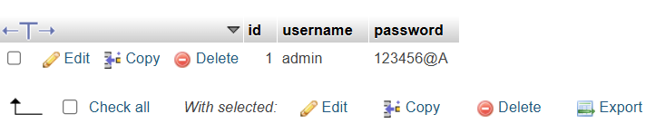

  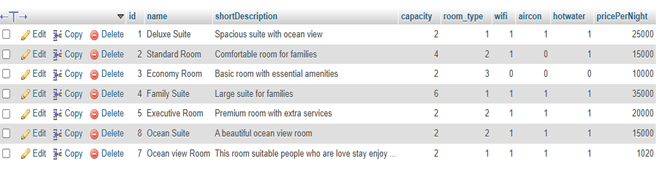

  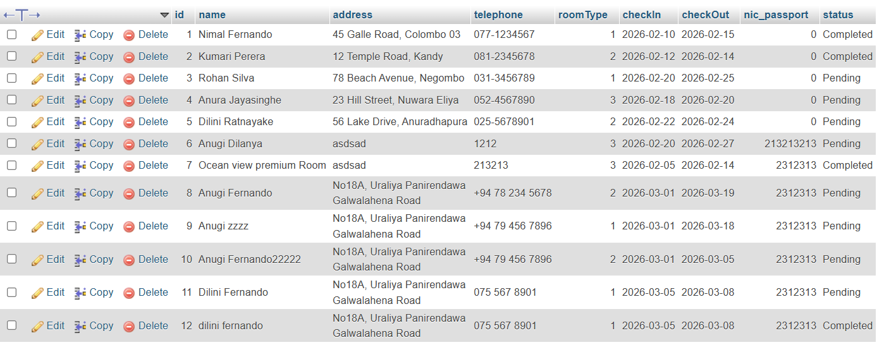

<h2>Testing Summary</h2>

  The assignment applies <strong>Test-Driven Development (TDD)</strong> principles using the
  <strong>Red → Green → Refactor</strong> cycle. Manual black-box testing was carried out to validate
  authentication, room management, reservation workflows, billing logic, and navigation.

<ul>
  <li><strong>24 test cases</strong> were documented in the assignment</li>
  <li>Happy paths and corner cases were both tested</li>
  <li>Validation checks covered empty inputs, invalid dates, and incorrect credentials</li>
  <li>Billing calculations and invoice rendering were verified with evidence screenshots</li>
</ul>

<h2> System Screenshots</h2>

<h3>1. Login Page</h3>

  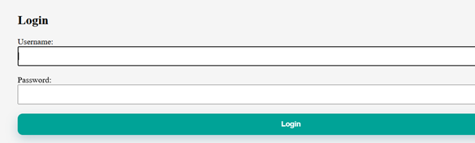

<h3>2. Dashboard / Reservation Creation</h3>

  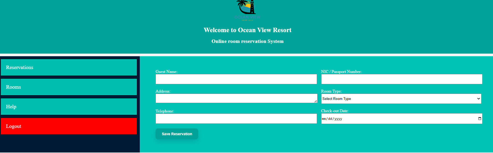

<h3>3. Help & Training Page</h3>

  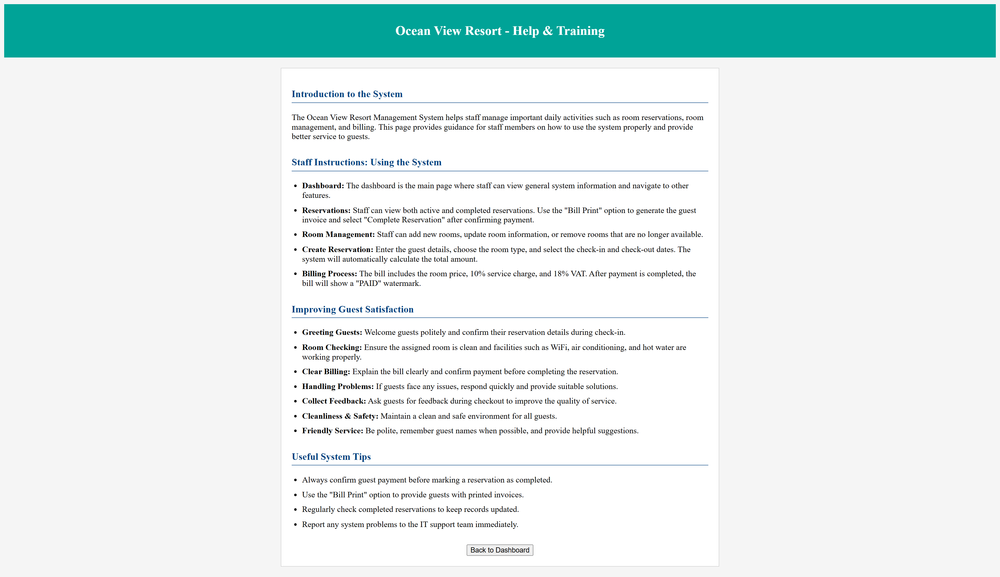

<h3>4. Reservation Management Page</h3>

  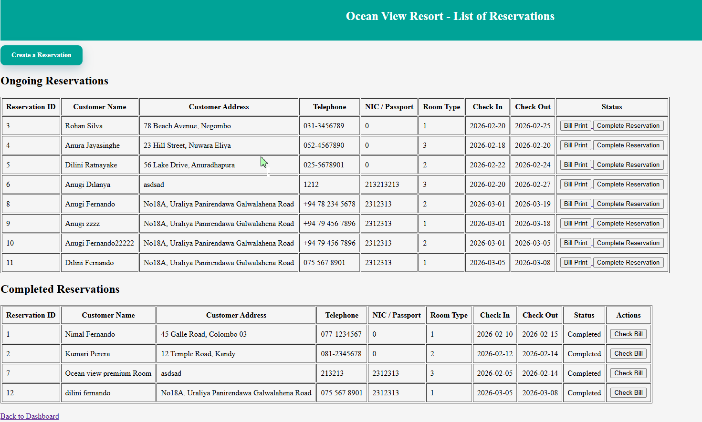

<h3>5. Rooms List Page</h3>

  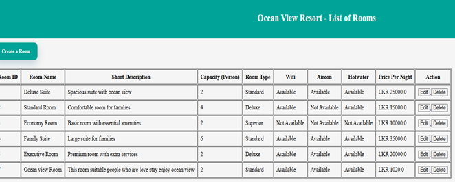

<h3>6. Add Room Form</h3>

  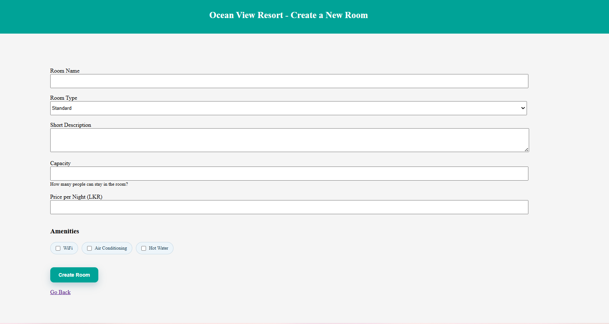

<h3>7. Ongoing Reservation Invoice</h3>

  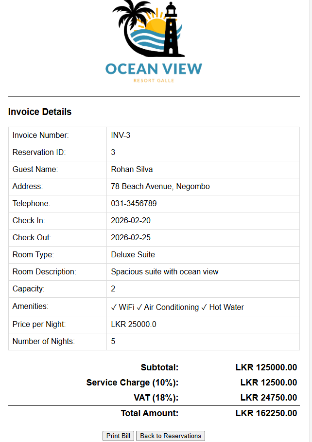

<h3>8. Completed Reservation Invoice with PAID Watermark</h3>

  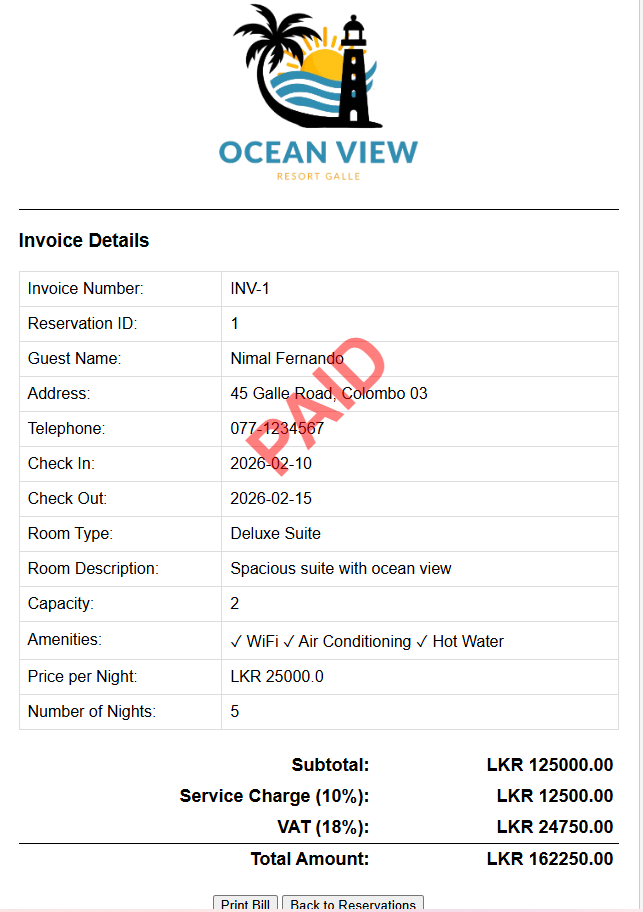

<h2>Demo Credentials</h2>

Use the following credentials to log into the system:

<pre><code>Username: admin
Password: 123456@A</code></pre>

<h2>How to Run the Project</h2>

<ol>
  <li>Clone this repository</li>
  <li>Open the project in NetBeans or your preferred Java IDE</li>
  <li>Create the MySQL database <code>oceanviewresort</code></li>
  <li>Import the required tables: <code>users</code>, <code>rooms</code>, and <code>reservation</code></li>
  <li>Update database credentials inside <code>DBConnection.java</code> if needed</li>
  <li>Build the project with Maven</li>
  <li>Deploy the application on Apache Tomcat or GlassFish</li>
  <li>Open the application in your browser and log in as staff</li>
</ol>

<h2>Author</h2>

  <strong>Anugi Dilanya Fernando</strong> 
  B.Sc. (Hons) in Software Engineering 
  Cardiff Metropolitan University

